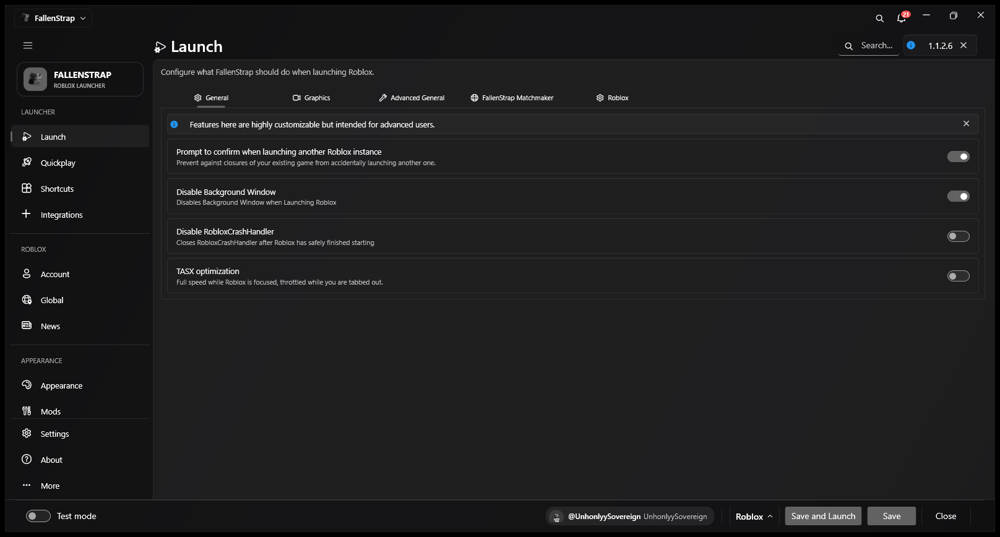
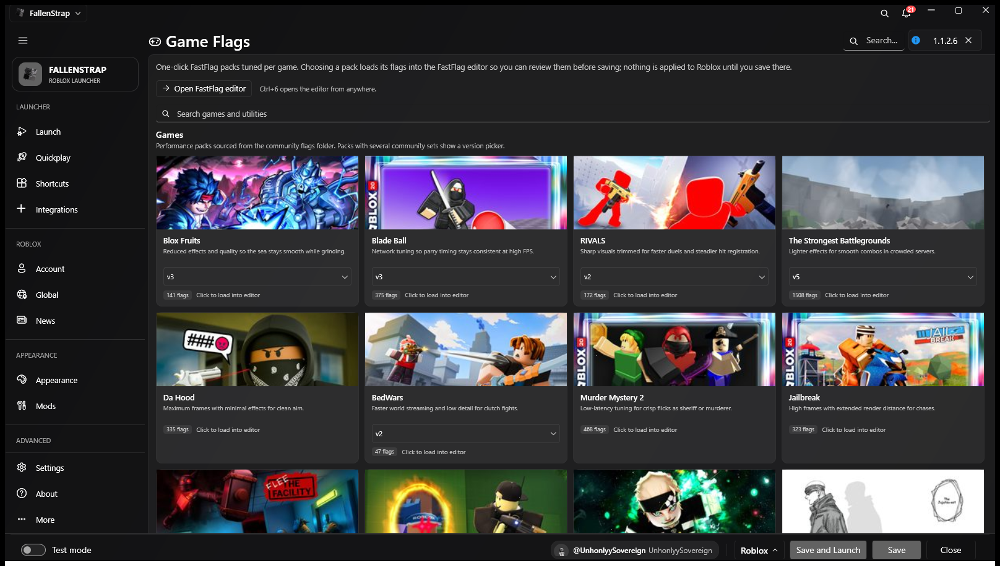
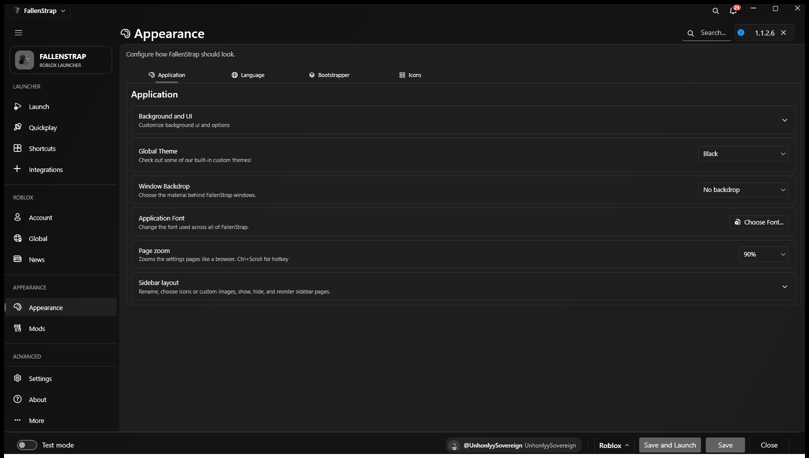
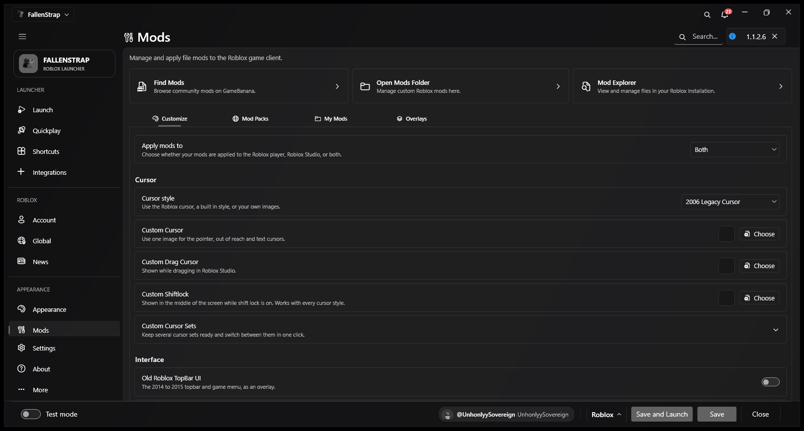

<h1 align="center"><b>FallenStrap</b></h1>

  <a href="https://github.com/zShift1/FallenStrap/releases/latest">Download</a> |
  <a href="https://discord.com/invite/TSs5mXrTD5">Discord</a>

[![Total Downloads][shield-repo-total]][repo-releases]
[![Latest Downloads][shield-repo-downloads]][repo-latest]
[![Latest Release][shield-repo-latest]][repo-latest]
[![Discord][shield-discord-server]][discord-invite]
[![Stars][shield-repo-stars]][repo-stargazers]
[![Sponsors][shield-repo-sponsors]][sponsor-link]

<h5 align="center">
  Leave a star if you like the project! ⭐️
</h5>

  

## Screenshots

<table>
<tr>
  <td width="50%"> <b>Launch</b> — every launch option in one place, with a Graphics tab for GPU and texture quality.</td>
  <td width="50%"> <b>Game Flags</b> — flag packs per game, grouped by version and ready to load into the editor.</td>
</tr>
<tr>
  <td width="50%"> <b>Appearance</b> — background, transparency, text size, cursors and sidebar layout.</td>
  <td width="50%"> <b>Mods</b> — install community mods and manage your own files.</td>
</tr>
</table>

## Install

1. Download the latest version
   👉 https://github.com/zShift1/FallenStrap/releases/latest
2. Run the exe
3. Launch FallenStrap
4. Enjoy a more simple Roblox

The published build carries the .NET runtime inside it, so there is nothing else
to install and no runtime to download first.

---

> [!IMPORTANT]
> FallenStrap supports **Windows 10 and above**.

> [!WARNING]
> FallenStrap is not an exploit and never will be. We are not considered an exploit. We are here to give users more freedom, features, and support for Roblox.
>
> Multi-Instance Launching was removed from the app and will not be added back in the future.

## FAQ

  
<strong>Can FallenStrap get me banned?</strong>

  FallenStrap does not inject cheats, exploit Roblox, or bypass Roblox security. It functions as a launcher and configuration manager.

  
<strong>Is FallenStrap a virus?</strong>

  It is a launcher, not a cheat, and it does not inject anything into Roblox.
  If your antivirus flags it, that is a false positive caused by how Windows handles unsigned applications.

  
<strong>Where is the source code?</strong>

  It is not published here. This repository exists to host the release downloads
  and the documentation. FallenStrap is built on the public VoidStrap and Bloxstrap
  projects, whose licenses and notices are kept in `LICENSE` and
  `LICENSE.FALLENSTRAP`.

[shield-repo-downloads]:  https://img.shields.io/github/downloads/zShift1/FallenStrap/latest/total?color=981bfe
[shield-repo-total]:      https://img.shields.io/github/downloads/zShift1/FallenStrap/total?color=8a2be2
[shield-repo-latest]:     https://img.shields.io/github/v/release/zShift1/FallenStrap?color=7a39fb
[shield-repo-stars]:      https://img.shields.io/github/stars/zShift1/FallenStrap?color=ffd700
[shield-discord-server]:  https://img.shields.io/discord/1551072846049050636?logo=discord&logoColor=white&label=Discord&color=4d3dff
[shield-repo-sponsors]:   https://img.shields.io/github/sponsors/zShift1?logo=githubsponsors&label=Sponsors&color=ea4aaa

[repo-releases]:          https://github.com/zShift1/FallenStrap/releases
[repo-latest]:            https://github.com/zShift1/FallenStrap/releases/latest
[repo-stargazers]:        https://github.com/zShift1/FallenStrap/stargazers
[discord-invite]:         https://discord.com/invite/TSs5mXrTD5
[sponsor-link]:           https://github.com/sponsors/zShift1